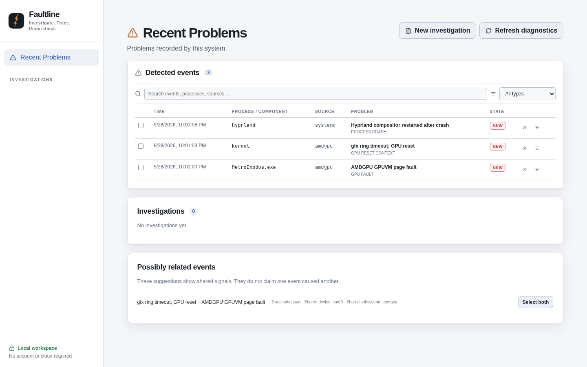
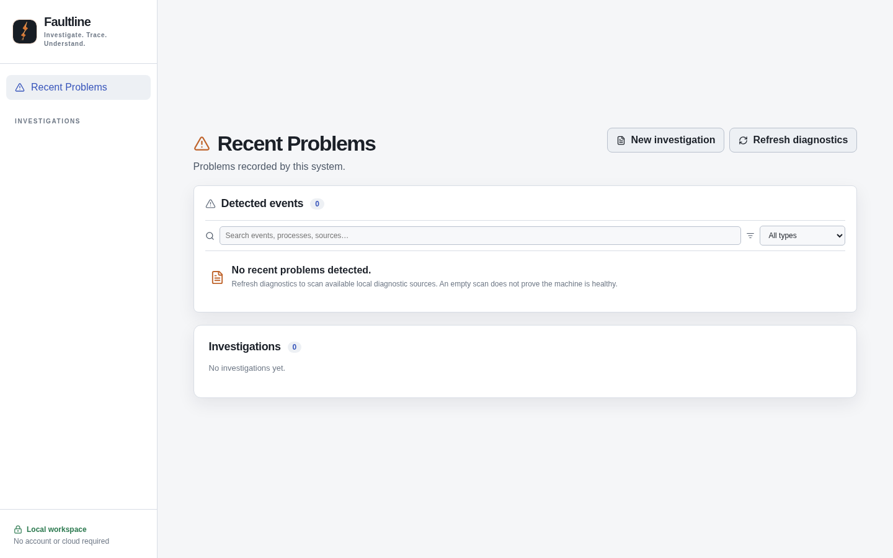

# Faultline

Faultline is local-first failure investigation. Correlate system events, trace evidence, compare reproductions, and isolate root causes. **Investigate. Trace. Understand.** Linux is the first supported platform.

## What Faultline is for

Faultline is a quiet workspace for figuring out what broke on your computer. It reads selected local diagnostic records, keeps the original evidence, and helps you compare reproductions without pretending that a nearby event proves the cause.

The normal path is:

1. Review **Recent Problems** and refresh the local journal when you want to scan it.
2. Select related-looking events, or choose **New investigation** for a problem that was not detected automatically.
3. Inspect the original evidence and the observations Faultline can support from it.
4. Record a baseline and later test attempts, including what changed and what stayed constant.
5. Review signature matches, hypotheses, the next useful test, and the **Do Not Yet** guidance.
6. Close the investigation with an honest outcome or export a redacted Markdown report.

The app does not repair the machine, run with administrator privileges, send diagnostics away, or require an AI provider. Empty or incomplete diagnostic results do not establish that the system is healthy.

### Recent Problems

The main screen is a compact event list. Search by problem, process, source, or device; filter by event type; select rows; and investigate them together. The selection action pre-fills a sensible investigation title and links the detected evidence for you.



When the local sources contain no supported records, Faultline keeps the empty state small and explicit.



## Run locally

Requires a supported Node.js release (Node 24 LTS or later) and npm. The current release has been built and tested in development on Linux with Node 26; verify Node 24 on your target distribution before packaging it as a supported build.

```sh
npm ci
npm run build
npm start
```

Open the loopback address printed by the launcher. The URL contains a one-time launch token; the browser exchanges it for a local, HTTP-only session cookie. Keep the terminal open while using Faultline and stop it with Ctrl+C. The app binds to `127.0.0.1` on a random port. It does not start a daemon, install a service, or need an account.

Data is stored in `~/.local/share/faultline/faultline.db` on Linux. Set `FAULTLINE_DATA_DIR` to a different private directory before starting if desired. The database contains original logs and may contain secrets. Faultline restricts its own data directory permissions, but does not encrypt the database; use appropriate disk security and avoid sharing it unintentionally.

Run the checks with `npm test` and `npm run build`. No AI provider is needed. The provider contract and fake-provider safety tests are included; live AI adapters are deferred.

## Investigate a problem

1. On Recent Problems, choose **Refresh diagnostics**. Review the exact read-only journal command and approve it. You can also create an investigation without scanning and paste or import a log file. Detected events can be dismissed, restored, or ignored by event type and process; matching rules can be disabled later.
2. Select one or more detected events, give the incident a neutral title, and describe your symptom. The description is recorded as your report.
3. Inspect original evidence. Supported parsers extract observations for AMDGPU GPUVM faults, address conflicts, Windows-style access violations, and a limited crash fallback. Unsupported material stays available for inspection and manual source-linked observations.
4. Record a baseline attempt with workload, duration, relevant configuration, and result. Attach evidence to that attempt. Later attempts compare against a baseline you explicitly select.
5. Review signature matches and environment differences. A strong pattern match means the reported failure pattern matches; it does not prove a shared cause. Missing configuration prevents an unconditional controlled-test label.
6. Review hypotheses and the suggested next step. Hypothesis assessments are user decisions with recorded reasons. A quiet test is inconclusive if the planned exposure or diagnostic coverage was insufficient.
7. Close the investigation with the actual outcome, even if root cause remains unproven. Preview the redacted Markdown export before downloading it. An explicit purge requires the incident title and removes unshared evidence blobs; ordinary closure keeps the record.

The app never changes system configuration, kills an application, runs with sudo, or automatically sends diagnostics away. A diagnostic scan is restricted to its displayed collector template and one approval. Manual imported evidence is limited to 10 MiB per file; a journal scan is limited to 20 MiB and 15 seconds. A partial scan is labelled partial. Journal visibility varies by distribution and user permissions. An empty result does not establish system health.

## Backup and recovery

With Faultline stopped or running, create a consistent SQLite backup to a **new**, absolute filename:

```sh
npm run backup -- /absolute/path/to/faultline-backup.db
```

Keep backups private: they contain the same sensitive evidence as the live database. To restore, stop Faultline, retain your current data directory separately, then place a verified backup at `~/.local/share/faultline/faultline.db` (or the directory selected with `FAULTLINE_DATA_DIR`) with access restricted to your user. Never copy only the live `.db` file while WAL mode is active; use the backup command.

## Current boundaries

- Linux journal discovery is supported without administrator access. Other Linux facilities may be missing or inaccessible. Manual import remains available.
- Windows and macOS fixtures exercise the platform-neutral parser and investigation rules, but native discovery adapters and installers for those systems are not included.
- AI is optional by design. This release includes no hosted or local model integration and no credential storage.
- Signature and redaction coverage is deliberately narrow. Inspect source evidence and review exports, especially before sharing them.
- Recurrence is a count of recorded episodes in available captures, not a rate, causal claim, or proof that all failures share a mechanism.
- The browser interface has a per-launch local session. Anyone with access to your signed-in desktop and the local data directory may be able to inspect stored diagnostics.
- This is an initial source build, not a validated public release. The automated suite, local browser check, and local API smoke check pass on the development machine; ordinary-user journal collection, Node 24 compatibility, clean-machine packaging, and broader Linux dogfooding remain release gates.

The [Phase 1 architecture](docs/ARCHITECTURE.md) records the intended product design and remaining release gates. See [SECURITY.md](SECURITY.md) for the security support policy.
